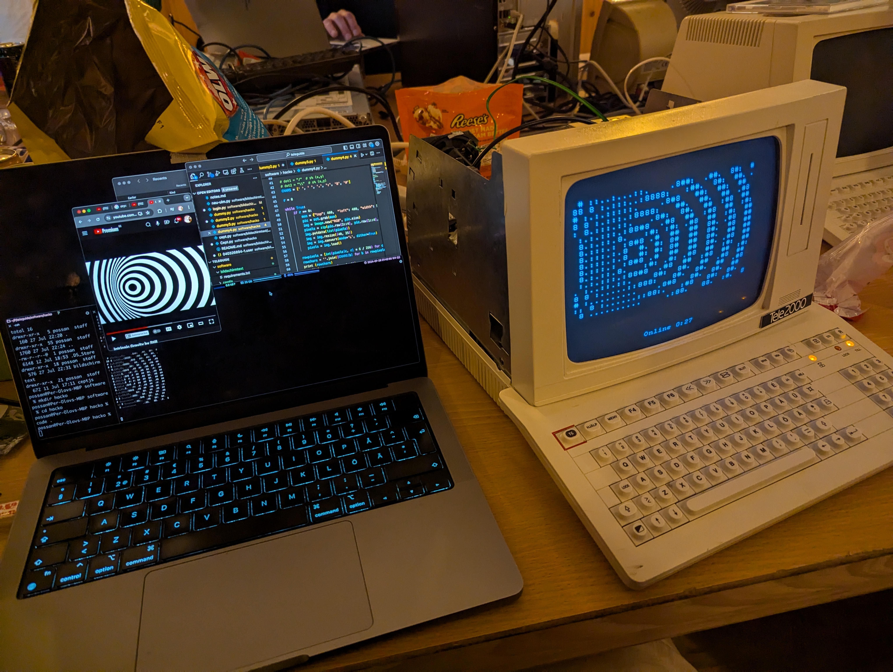

# 📺 📞 TeleGuide hacking

Placeholder for content related to understanding and hacking the TeleGuide.

## 🌍 Links to online resources

* [Wikipedia](https://sv.wikipedia.org/wiki/Teleguide) (Swedish)
* [OldComputer.info: TeleGuide](https://oldcomputer.info/terminal/Teleguide/index.htm)
* [OldComputer.info: Loewe MultiTel-D](https://oldcomputer.info/terminal/multitel_D/index.htm)
* [OldComputer.info: Gallery](https://oldcomputer.info/gallery.php?spgmGal=Museum/Terminals/Teleguide) Pictures of device and PCBs
* [Videotex.se](https://www.videotex.se/) TeleGuide and DataVision Magazine scans

## 📕 References

* [Loewe MultiTel-D Service Manual](reference-manuals/loewe_multitel-p-service-manual.pdf) (German) Full schematics except for the cardreader only found on the Swedish variant
* [Loewe MultiTel-D User Manual](reference-manuals/multi-d.pdf) (German)

## 🛠 Code

* [Bildschirmtext](https://github.com/bildschirmtext/bildschirmtext) Python serial server simulating Bildschirmtext
* [CeptJs](https://github.com/stblassitude/ceptjs) Great debugging tool for Cept commands used to draw the screen
* [My silly serial hacks](software/tests/) A couple of small python scripts to send serial data to the terminal

## 💾 EPROM Dumps

From files found online and from my machines.

* [Main board](firmwares/mainboard)
* [Card reader](firmwares/cardreaderboard)
* [Modem](firmwares/modemboard)

## 🛠 Disassembly

* [GHIDRA](https://ghidra-sre.org/) in 8051 mode works good enough to disassemble and follow branching in the code

